# MVP User Journeys & Flows

> **Task #3** | Status: ✅ Completed  
> Defines the core user journeys for Hairadresser MVP

---

## 🎯 Goal

Define and document the core user journeys to ensure we build the right flows first.

---

## User Roles (MVP)

| Role | Description |
|------|-------------|
| **Customer** | End user booking appointments |
| **Hairdresser** | Business owner managing salon |
| **Admin** | Same as Hairdresser in MVP |

> **Note:** In MVP, Admin = Hairdresser. No advanced roles or permissions.

---

## Journey 1: Customer Books a Haircut

**Entry:** Public website  
**Exit:** Booking confirmation screen  
**Time Goal:** Under 2 minutes

```mermaid
flowchart TD
    A[🏠 Land on Website] --> B[📋 View Services & Prices]
    B --> C[✅ Select Service]
    C --> D[📅 Choose Date]
    D --> E{Slots Available?}
    E -->|Yes| F[⏰ Select Time Slot]
    E -->|No| G[📅 Choose Different Date]
    G --> E
    F --> H[📝 Enter Contact Details]
    H --> I{Valid Details?}
    I -->|No| J[⚠️ Show Error]
    J --> H
    I -->|Yes| K[👁️ Review Booking]
    K --> L[✅ Confirm Booking]
    L --> M[🎉 Confirmation Screen]
    L --> N[📧 Send Confirmation Email]
```

### Steps
1. Customer lands on the public website
2. Views services and prices
3. Selects a service
4. Selects date and available time slot
5. Enters basic contact details (name, phone, email)
6. Reviews and confirms booking
7. Sees confirmation screen
8. Receives confirmation email

### Success Criteria
- [x] Booking completed in under 2 minutes
- [x] No account or login required
- [x] Clear confirmation after booking
- [x] Handles "no availability" gracefully

### Error Cases
| Error | Handling |
|-------|----------|
| No available slots | Show message, suggest different date |
| Invalid email/phone | Inline validation, don't submit |
| Slot taken (race condition) | Show error, return to slot selection |

---

## Journey 2: Customer Cancels a Booking

**Entry:** Cancellation link in email  
**Exit:** Cancellation confirmation

```mermaid
flowchart TD
    A[📧 Click Cancel Link in Email] --> B[🔍 View Booking Details]
    B --> C[❌ Click Cancel Button]
    C --> D{Confirm Cancel?}
    D -->|No| B
    D -->|Yes| E[✅ Booking Cancelled]
    E --> F[📧 Cancellation Email Sent]
```

### Steps
1. Customer clicks cancellation link in confirmation email
2. Views booking details
3. Confirms cancellation
4. Receives cancellation confirmation

### Rules
- Cancellation allowed up to 24 hours before appointment
- No login required (secure token in link)

---

## Journey 3: Hairdresser Manages Availability

**Entry:** Admin login  
**Exit:** Availability updated

```mermaid
flowchart TD
    A[🔐 Login to Admin] --> B[📊 View Dashboard]
    B --> C{What to do?}
    C -->|Set Hours| D[⏰ Set Working Days/Hours]
    C -->|Block Time| E[🚫 Block Time Slots]
    C -->|View Bookings| F[📅 View Calendar]
    D --> G[💾 Save Changes]
    E --> G
    G --> H[✅ Availability Updated]
    H --> I[👥 Customers See New Slots]
```

### Steps
1. Hairdresser logs in to admin
2. Sets working days and hours
3. Blocks unavailable time slots (vacation, breaks)
4. Views upcoming bookings
5. Edits or cancels bookings if needed

### Success Criteria
- [x] Availability changes immediately affect booking options
- [x] Easy view of upcoming bookings
- [x] No double bookings possible

---

## Journey 4: Hairdresser Manages Services

**Entry:** Admin dashboard  
**Exit:** Services updated on website

```mermaid
flowchart TD
    A[📊 Admin Dashboard] --> B[🛠️ Services Management]
    B --> C{Action?}
    C -->|Add| D[➕ Create New Service]
    C -->|Edit| E[✏️ Edit Service Details]
    C -->|Delete| F[🗑️ Delete Service]
    D --> G[Set Name, Duration, Price]
    E --> G
    G --> H[💾 Save]
    F --> I{Confirm Delete?}
    I -->|Yes| J[❌ Service Removed]
    I -->|No| B
    H --> K[✅ Service Updated on Website]
```

---

## Notifications (MVP)

| Event | Notification | Recipient |
|-------|--------------|-----------|
| Booking created | Email confirmation | Customer |
| Booking cancelled | Email notification | Customer + Hairdresser |
| New booking | Email alert (optional) | Hairdresser |

---

## Out of Scope (Post-MVP)

| Feature | Why Excluded |
|---------|--------------|
| Online payments | Adds complexity, trust |
| Customer accounts | MVP = no login |
| Reviews and ratings | Not core to booking |
| Multi-location | MVP = one salon |
| Multiple staff | MVP = one hairdresser |
| Analytics dashboard | Nice-to-have, not essential |
| Loyalty programs | Post-MVP feature |
| Discount codes | Post-MVP feature |

---

## Acceptance Criteria

- [x] All MVP user journeys documented
- [x] Entry and exit points defined
- [x] Visual flow diagrams added
- [x] Error cases identified
- [x] Cancellation flow included
- [x] Notification triggers defined
- [x] MVP vs post-MVP agreed
- [x] Ready for data modeling (Task #4)
