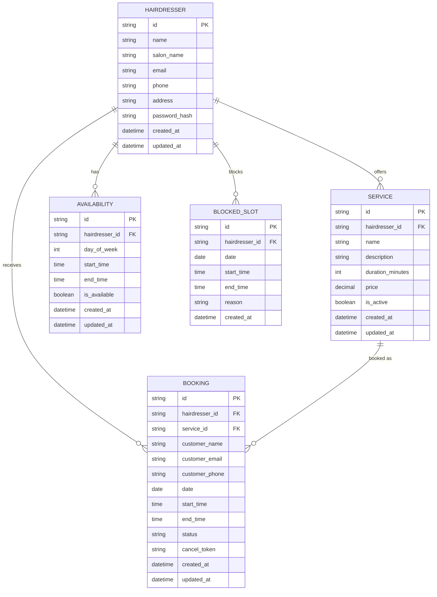

# Booking & Availability Data Model

> **Task #4** | Status: ✅ Completed  
> Defines the database schema for Hairadresser MVP

---

## 🎯 Goal

Design the core data model for bookings and availability that supports all MVP user journeys.

---

## Entity Relationship Diagram



---

## Entities

### 1. Hairdresser
The business owner (single hairdresser in MVP).

| Field | Type | Required | Description |
|-------|------|----------|-------------|
| `id` | UUID | ✅ | Primary key |
| `name` | String | ✅ | Owner name |
| `salon_name` | String | ✅ | Business name |
| `email` | String | ✅ | Contact email |
| `phone` | String | ❌ | Contact phone |
| `address` | String | ❌ | Salon address |
| `password_hash` | String | ✅ | Admin login |
| `created_at` | DateTime | ✅ | Record created |
| `updated_at` | DateTime | ✅ | Last modified |

---

### 2. Service
What can be booked.

| Field | Type | Required | Description |
|-------|------|----------|-------------|
| `id` | UUID | ✅ | Primary key |
| `hairdresser_id` | UUID | ✅ | Foreign key |
| `name` | String | ✅ | Service name |
| `description` | String | ❌ | Service details |
| `duration_minutes` | Int | ✅ | Length of service |
| `price` | Decimal | ✅ | Price in DKK |
| `is_active` | Boolean | ✅ | Show on website |
| `created_at` | DateTime | ✅ | Record created |
| `updated_at` | DateTime | ✅ | Last modified |

---

### 3. Availability
Weekly schedule for the hairdresser.

| Field | Type | Required | Description |
|-------|------|----------|-------------|
| `id` | UUID | ✅ | Primary key |
| `hairdresser_id` | UUID | ✅ | Foreign key |
| `day_of_week` | Int | ✅ | 0=Sunday, 1=Monday... |
| `start_time` | Time | ✅ | Opens at |
| `end_time` | Time | ✅ | Closes at |
| `is_available` | Boolean | ✅ | Working this day |
| `created_at` | DateTime | ✅ | Record created |
| `updated_at` | DateTime | ✅ | Last modified |

---

### 4. BlockedSlot *(New - Added)*
Specific blocked times (vacation, breaks).

| Field | Type | Required | Description |
|-------|------|----------|-------------|
| `id` | UUID | ✅ | Primary key |
| `hairdresser_id` | UUID | ✅ | Foreign key |
| `date` | Date | ✅ | Specific date |
| `start_time` | Time | ❌ | Block from (null = all day) |
| `end_time` | Time | ❌ | Block until |
| `reason` | String | ❌ | "Vacation", "Lunch" |
| `created_at` | DateTime | ✅ | Record created |

---

### 5. Booking
Customer appointment.

| Field | Type | Required | Description |
|-------|------|----------|-------------|
| `id` | UUID | ✅ | Primary key |
| `hairdresser_id` | UUID | ✅ | Foreign key |
| `service_id` | UUID | ✅ | Foreign key |
| `customer_name` | String | ✅ | Customer name |
| `customer_email` | String | ✅ | For confirmation |
| `customer_phone` | String | ❌ | Optional contact |
| `date` | Date | ✅ | Appointment date |
| `start_time` | Time | ✅ | Start time |
| `end_time` | Time | ✅ | Auto-calculated |
| `status` | Enum | ✅ | confirmed/cancelled |
| `cancel_token` | String | ✅ | For cancel link |
| `created_at` | DateTime | ✅ | Record created |
| `updated_at` | DateTime | ✅ | Last modified |

---

## Prisma Schema

```prisma
generator client {
  provider = "prisma-client-js"
}

datasource db {
  provider = "postgresql"
  url      = env("DATABASE_URL")
}

model Hairdresser {
  id           String        @id @default(uuid())
  name         String
  salonName    String
  email        String        @unique
  phone        String?
  address      String?
  passwordHash String
  createdAt    DateTime      @default(now())
  updatedAt    DateTime      @updatedAt

  services     Service[]
  availability Availability[]
  blockedSlots BlockedSlot[]
  bookings     Booking[]
}

model Service {
  id              String   @id @default(uuid())
  hairdresserId   String
  name            String
  description     String?
  durationMinutes Int
  price           Decimal  @db.Decimal(10, 2)
  isActive        Boolean  @default(true)
  createdAt       DateTime @default(now())
  updatedAt       DateTime @updatedAt

  hairdresser Hairdresser @relation(fields: [hairdresserId], references: [id])
  bookings    Booking[]

  @@index([hairdresserId])
}

model Availability {
  id            String   @id @default(uuid())
  hairdresserId String
  dayOfWeek     Int      // 0=Sunday, 6=Saturday
  startTime     String   // "09:00"
  endTime       String   // "17:00"
  isAvailable   Boolean  @default(true)
  createdAt     DateTime @default(now())
  updatedAt     DateTime @updatedAt

  hairdresser Hairdresser @relation(fields: [hairdresserId], references: [id])

  @@unique([hairdresserId, dayOfWeek])
  @@index([hairdresserId])
}

model BlockedSlot {
  id            String   @id @default(uuid())
  hairdresserId String
  date          DateTime @db.Date
  startTime     String?  // null = whole day blocked
  endTime       String?
  reason        String?
  createdAt     DateTime @default(now())

  hairdresser Hairdresser @relation(fields: [hairdresserId], references: [id])

  @@index([hairdresserId, date])
}

model Booking {
  id            String   @id @default(uuid())
  hairdresserId String
  serviceId     String
  customerName  String
  customerEmail String
  customerPhone String?
  date          DateTime @db.Date
  startTime     String   // "10:00"
  endTime       String   // "10:30"
  status        String   @default("confirmed") // confirmed, cancelled
  cancelToken   String   @unique @default(uuid())
  createdAt     DateTime @default(now())
  updatedAt     DateTime @updatedAt

  hairdresser Hairdresser @relation(fields: [hairdresserId], references: [id])
  service     Service     @relation(fields: [serviceId], references: [id])

  @@index([hairdresserId, date])
  @@index([cancelToken])
}
```

---

## Business Rules

| Rule | Implementation |
|------|----------------|
| No overlapping bookings | Check before insert |
| Booking fits availability | Validate against Availability table |
| Booking not in blocked slot | Check BlockedSlot table |
| End time auto-calculated | `end_time = start_time + service.duration` |
| 24-hour cancellation | Check `date - now > 24h` |

---

## Availability Check Algorithm

```
1. Get day_of_week from requested date
2. Find Availability for that day
3. If not available → reject
4. Get all BlockedSlots for that date
5. Get all confirmed Bookings for that date
6. Calculate available slots based on service duration
7. Return available time slots
```

---

## Acceptance Criteria

- [x] All entities defined with data types
- [x] ER diagram shows relationships
- [x] Prisma schema ready to use
- [x] BlockedSlot entity added for breaks/vacation
- [x] Indexes for performance
- [x] Business rules documented
- [x] Ready for API implementation
