# Booking Rules & Constraints

> **Task #5** | Status: ✅ Completed  
> Defines the business rules for booking validation

---

## 🎯 Goal

Define clear rules that ensure bookings are valid, conflict-free, and predictable.

---

## Time Configuration

| Setting | Value | Reason |
|---------|-------|--------|
| **Slot Interval** | 30 minutes | Standard industry practice |
| **Minimum Notice** | 2 hours | Hairdresser needs prep time |
| **Maximum Advance** | 30 days | Prevents too-far bookings |
| **Timezone** | Europe/Copenhagen | Danish local time |

---

## Booking Validation Flow

```mermaid
flowchart TD
    A[New Booking Request] --> B{Date in valid range?}
    B -->|No| X1[❌ Reject: Too far ahead or in past]
    B -->|Yes| C{Minimum notice met?}
    C -->|No| X2[❌ Reject: Too short notice]
    C -->|Yes| D{Is day available?}
    D -->|No| X3[❌ Reject: Salon closed]
    D -->|Yes| E{Within working hours?}
    E -->|No| X4[❌ Reject: Outside hours]
    E -->|Yes| F{In blocked slot?}
    F -->|Yes| X5[❌ Reject: Time blocked]
    F -->|No| G{Overlaps existing booking?}
    G -->|Yes| X6[❌ Reject: Slot taken]
    G -->|No| H[✅ Create Booking]
```



---

## Rule Categories

### 1. Time Slot Rules

| Rule | Description |
|------|-------------|
| Duration from service | Booking length = service.duration_minutes |
| Start on interval | Must start at :00 or :30 |
| Fits in availability | Must start AND end within working hours |
| No partial overlap | Entire booking must fit |

**Example:**
```
Service: Haircut (30 min)
Request: 10:00 → OK (ends 10:30)
Request: 10:15 → REJECT (not on interval)
Working hours: 09:00-17:00
Request: 16:45 → REJECT (would end at 17:15)
```

---

### 2. Availability Rules

| Rule | Description |
|------|-------------|
| Weekly schedule | Defined per day (Mon-Sun) |
| Start/end times | When salon opens/closes |
| Closed days | `is_available = false` |
| BlockedSlots override | Specific dates blocked |

**Example:**
```
Monday: 09:00 - 17:00 (open)
Tuesday: 09:00 - 17:00 (open)
Sunday: closed
Dec 25: blocked (holiday)
```

---

### 3. Conflict Rules

| Rule | Description |
|------|-------------|
| No overlap with bookings | New booking can't clash with confirmed |
| No overlap with blocked | Blocked time = unavailable |
| Cancelled = free | Cancelled bookings release slot |
| Edge-to-edge OK | 10:00-10:30 + 10:30-11:00 = allowed |

**Overlap Check (PostgreSQL):**
```sql
SELECT * FROM bookings
WHERE date = :date
  AND status = 'confirmed'
  AND (
    (start_time < :end_time AND end_time > :start_time)
  )
```

---

### 4. Status Rules

| Status | Meaning | Can Transition To |
|--------|---------|-------------------|
| `confirmed` | Active booking | → cancelled |
| `cancelled` | Customer cancelled | (final) |

**Rules:**
- New bookings → `confirmed`
- No `pending` state in MVP
- No rescheduling (cancel + rebook)
- Cancelled slots become available immediately

---

### 5. Advance Booking Rules

| Rule | Value | Validation |
|------|-------|------------|
| Not in the past | date ≥ today | Check date |
| Minimum notice | 2 hours | Check datetime |
| Maximum advance | 30 days | Check date diff |

**Example:**
```
Now: Jan 26, 10:00
Request for Jan 26, 11:00 → REJECT (less than 2 hours)
Request for Jan 26, 14:00 → OK
Request for Mar 15 → REJECT (more than 30 days)
```

---

### 6. Customer Rules

| Rule | Description |
|------|-------------|
| No account needed | Guest booking only |
| Required: name | Must provide full name |
| Required: contact | Email OR phone |
| Soft limit | 1 active booking (not enforced MVP) |

---

### 7. Cancellation Rules

| Rule | Value |
|------|-------|
| Allowed until | 24 hours before |
| Method | Link in confirmation email |
| Token | Unique per booking |
| Late cancellation | Not allowed in MVP |

---

## Error Messages

| Validation | Error Message |
|------------|---------------|
| Past date | "Cannot book in the past" |
| Too soon | "Please book at least 2 hours in advance" |
| Too far | "Cannot book more than 30 days ahead" |
| Closed day | "Salon is closed on this day" |
| Outside hours | "Selected time is outside working hours" |
| Blocked time | "This time slot is not available" |
| Already booked | "This time slot is already taken" |
| Invalid interval | "Please select a time on the hour or half hour" |
| Late cancel | "Cancellation not allowed within 24 hours" |

---

## Edge Cases

| Scenario | Outcome |
|----------|---------|
| Booking at opening time (09:00) | ✅ Allowed |
| Booking ending at closing (17:00) | ✅ Allowed |
| Booking spanning lunch block | ❌ Rejected |
| Two bookings back-to-back | ✅ Allowed |
| Same customer books twice | ✅ Allowed (MVP) |

---

## Implementation Notes

### Validation Order (Backend)
```typescript
async function validateBooking(data: BookingInput) {
  // 1. Check date not in past
  // 2. Check minimum notice (2 hours)
  // 3. Check maximum advance (30 days)
  // 4. Check day availability
  // 5. Check working hours
  // 6. Check blocked slots
  // 7. Check existing bookings
  // 8. Calculate end_time from service
  // 9. Create booking
}
```

### Frontend Pre-validation
- Disable past dates in calendar
- Only show available days
- Only show available slots
- Validate contact format before submit

---

## Out of Scope (Post-MVP)

| Feature | Why Excluded |
|---------|--------------|
| Buffer time between bookings | Adds complexity |
| Waiting lists | Not essential for MVP |
| Recurring bookings | Post-MVP feature |
| Deposits | Requires payments |
| Customer booking limits | Soft trust for MVP |

---

## Acceptance Criteria

- [x] All booking rules clearly defined
- [x] Time configuration explicit (intervals, notice, advance)
- [x] Validation flow documented
- [x] Error messages specified
- [x] Edge cases handled
- [x] Ready for API implementation
