# Admin Workflows (MVP)

> **Task #6** | Status: ✅ Completed  
> Defines the hairdresser/owner admin workflows

---

## 🎯 Goal

Define admin workflows that allow the hairdresser to manage services, availability, and bookings.

---

## Admin Role (MVP)

| Aspect | Value |
|--------|-------|
| Users | 1 admin only |
| Role | Admin = Hairdresser = Owner |
| Auth | Simple password login |
| Permissions | Full access (no roles) |

---

## Admin Login Flow

```mermaid
flowchart TD
    A[🔐 Visit /admin] --> B{Already logged in?}
    B -->|Yes| C[📊 Dashboard]
    B -->|No| D[📝 Login Form]
    D --> E[Enter Password]
    E --> F{Correct?}
    F -->|No| G[❌ Error Message]
    G --> D
    F -->|Yes| H[🍪 Set Session Cookie]
    H --> C
```



**Implementation:**
- Simple password check (no email)
- Session cookie (7 days)
- Logout clears cookie

---

## Workflow 1: Service Management

```mermaid
flowchart TD
    A[📊 Dashboard] --> B[🛠️ Services]
    B --> C{Action?}
    C -->|Create| D[➕ Add Service Form]
    C -->|Edit| E[✏️ Edit Service Form]
    C -->|Delete| F[🗑️ Confirm Delete]
    D --> G[Save]
    E --> G
    F --> H{Has future bookings?}
    H -->|Yes| I[⚠️ Warning: Existing bookings]
    H -->|No| J[Delete Service]
    I --> K{Confirm anyway?}
    K -->|Yes| L[Mark service inactive]
    K -->|No| B
```



### Service Fields

| Field | Type | Required |
|-------|------|----------|
| Name | String | ✅ |
| Description | String | ❌ |
| Duration | Integer (minutes) | ✅ |
| Price | Decimal (DKK) | ✅ |
| Active | Boolean | ✅ |

### Rules
- Changes affect future bookings only
- Cannot delete service with future bookings (mark inactive instead)
- Inactive services hidden from booking page

---

## Workflow 2: Availability Management

```mermaid
flowchart TD
    A[📊 Dashboard] --> B[📅 Availability]
    B --> C[View Weekly Schedule]
    C --> D[Select Day]
    D --> E{Edit?}
    E -->|Set Hours| F[Set Start/End Time]
    E -->|Mark Closed| G[Set is_available = false]
    F --> H[💾 Save]
    G --> H
    H --> I[✅ Updated]
    I --> C
```



### Weekly Schedule View

| Day | Open | Start | End |
|-----|------|-------|-----|
| Monday | ✅ | 09:00 | 17:00 |
| Tuesday | ✅ | 09:00 | 17:00 |
| Wednesday | ✅ | 09:00 | 17:00 |
| Thursday | ✅ | 09:00 | 17:00 |
| Friday | ✅ | 09:00 | 17:00 |
| Saturday | ✅ | 10:00 | 14:00 |
| Sunday | ❌ | - | - |

### Rules
- Changes take effect immediately for new bookings
- Existing bookings remain valid (not auto-cancelled)
- Warning shown if reducing hours with existing bookings

---

## Workflow 3: Blocked Time Management

```mermaid
flowchart TD
    A[📊 Dashboard] --> B[🚫 Blocked Times]
    B --> C[View Calendar]
    C --> D{Action?}
    D -->|Block| E[Select Date/Time Range]
    D -->|Unblock| F[Remove Block]
    E --> G[Optional: Add Reason]
    G --> H[💾 Save Block]
    F --> I[✅ Slot Available Again]
    H --> J[✅ Slot Blocked]
```



### Block Types

| Type | Example | Fields |
|------|---------|--------|
| Full day | Holiday | date only |
| Time range | Lunch | date + start + end |
| Recurring | N/A MVP | not supported |

### Rules
- Blocked times override availability
- Cannot block past dates
- Warning if booking exists in blocked range
- Existing bookings NOT auto-cancelled

---

## Workflow 4: Booking Management

```mermaid
flowchart TD
    A[📊 Dashboard] --> B[📋 Bookings]
    B --> C[View List/Calendar]
    C --> D[Select Booking]
    D --> E[View Details]
    E --> F{Action?}
    F -->|Cancel| G[Confirm Cancel]
    G --> H[Booking Cancelled]
    H --> I[📧 Email Customer]
    F -->|View Only| J[Back to List]
```



### Booking List View

| Customer | Service | Date | Time | Status | Actions |
|----------|---------|------|------|--------|---------|
| John Doe | Haircut | Jan 27 | 10:00 | ✅ Confirmed | Cancel |
| Jane Smith | Color | Jan 27 | 14:00 | ✅ Confirmed | Cancel |

### Booking Detail View
- Customer name
- Customer email/phone
- Service name & duration
- Date & time
- Status
- Created at
- Cancel button

### Rules
- Admin can cancel any booking
- Cancelled bookings free slot immediately
- Customer receives cancellation email
- No reschedule (cancel + customer rebooks)

---

## Admin Dashboard Layout

```
┌─────────────────────────────────────────────────────────────┐
│  🏠 Hairadresser Admin                      [Logout]        │
├─────────────────────────────────────────────────────────────┤
│                                                             │
│  📊 Today's Overview                                        │
│  ┌─────────────┐  ┌─────────────┐  ┌─────────────┐         │
│  │ 5 Bookings  │  │ 2 Available │  │ 1 Blocked   │         │
│  │   Today     │  │   Slots     │  │   Hours     │         │
│  └─────────────┘  └─────────────┘  └─────────────┘         │
│                                                             │
│  📅 Upcoming Bookings                                       │
│  ┌─────────────────────────────────────────────────────┐   │
│  │ 10:00  John Doe - Haircut (30 min)           Cancel │   │
│  │ 11:00  Jane Smith - Color (60 min)           Cancel │   │
│  │ 14:00  Bob Wilson - Trim (20 min)            Cancel │   │
│  └─────────────────────────────────────────────────────┘   │
│                                                             │
│  Quick Actions                                              │
│  [🛠️ Services] [📅 Availability] [🚫 Block Time]           │
│                                                             │
└─────────────────────────────────────────────────────────────┘
```

---

## API Endpoints (Admin)

| Method | Endpoint | Action |
|--------|----------|--------|
| POST | `/api/admin/login` | Login |
| POST | `/api/admin/logout` | Logout |
| GET | `/api/admin/services` | List services |
| POST | `/api/admin/services` | Create service |
| PUT | `/api/admin/services/:id` | Update service |
| DELETE | `/api/admin/services/:id` | Delete/deactivate |
| GET | `/api/admin/availability` | Get schedule |
| PUT | `/api/admin/availability` | Update schedule |
| GET | `/api/admin/blocked` | List blocked slots |
| POST | `/api/admin/blocked` | Create block |
| DELETE | `/api/admin/blocked/:id` | Remove block |
| GET | `/api/admin/bookings` | List bookings |
| GET | `/api/admin/bookings/:id` | Booking details |
| PUT | `/api/admin/bookings/:id/cancel` | Cancel booking |

---

## Edge Cases

| Scenario | Handling |
|----------|----------|
| Reduce hours with existing bookings | ⚠️ Warning, bookings kept |
| Delete service with future bookings | Mark inactive, keep bookings |
| Block time with existing booking | ⚠️ Warning, booking kept |
| Admin cancels booking | Email sent to customer |
| Same email for multiple bookings | Allowed in MVP |

---

## Out of Scope (Post-MVP)

| Feature | Reason |
|---------|--------|
| Multiple admins | Single owner MVP |
| Staff permissions | No roles in MVP |
| Analytics | Not essential |
| Bulk actions | Keep it simple |
| Auto-cancel conflicts | Manual review preferred |

---

## Acceptance Criteria

- [x] All admin workflows defined
- [x] Login/logout flow included
- [x] Dashboard layout sketched
- [x] API endpoints listed
- [x] Edge cases documented
- [x] Ready for UI implementation
