# Project Architecture

> Visual guide to how the Hairadresser MVP is organized

---

## High-Level Architecture

```mermaid
flowchart TB
    subgraph Client["🌐 Browser"]
        User[Customer/Admin]
    end

    subgraph NextJS["⚡ Next.js Application"]
        subgraph Frontend["Frontend (React)"]
            Pages["📄 Pages<br/>src/app/page.tsx"]
            Components["🧩 Components<br/>src/components/"]
        end
        
        subgraph Backend["Backend (API Routes)"]
            API["🔌 API Routes<br/>src/app/api/"]
        end
        
        subgraph Shared["Shared"]
            Lib["📚 Library<br/>src/lib/db.ts"]
        end
    end

    subgraph Database["🗄️ PostgreSQL"]
        DB[(Database)]
    end

    User --> Pages
    Pages --> API
    API --> Lib
    Lib --> DB
```

---

## File Structure Explained

```mermaid
flowchart LR
    subgraph Root["📁 Project Root"]
        direction TB
        
        subgraph SRC["src/"]
            APP["app/<br/>📄 Pages & API"]
            LIB["lib/<br/>📚 Utilities"]
            COMP["components/<br/>🧩 UI Parts"]
        end
        
        subgraph PRISMA["prisma/"]
            SCHEMA["schema.prisma<br/>🗃️ DB Models"]
            SEED["seed.ts<br/>🌱 Initial Data"]
            MIG["migrations/<br/>📋 DB Changes"]
        end
        
        subgraph DOCS["docs/"]
            DOC1["01-09<br/>📖 Documentation"]
        end
    end
```

---

## What Each File Does

### `src/app/` - Pages & Routes

---

### `src/lib/db.ts` - Database Connection

---

### `prisma/` - Database Schema

---

## Data Flow

```mermaid
sequenceDiagram
    participant U as 👤 User
    participant P as 📄 Page (page.tsx)
    participant D as 📚 DB Client (db.ts)
    participant DB as 🗄️ PostgreSQL

    U->>P: Visit homepage
    P->>D: getServices()
    D->>DB: SELECT * FROM services
    DB-->>D: Return services
    D-->>P: Return data
    P-->>U: Render page with services
```

---

## Summary Table

| File/Folder | Purpose | Type |
|-------------|---------|------|
| `src/app/page.tsx` | Homepage UI | Frontend |
| `src/app/layout.tsx` | Root layout (fonts, meta) | Frontend |
| `src/app/api/*` | REST API endpoints | Backend |
| `src/lib/db.ts` | Database connection | Shared |
| `prisma/schema.prisma` | Database models | Config |
| `prisma/seed.ts` | Initial test data | Script |
| `docker-compose.yml` | Local PostgreSQL | DevOps |
| `docs/*` | Project documentation | Docs |
